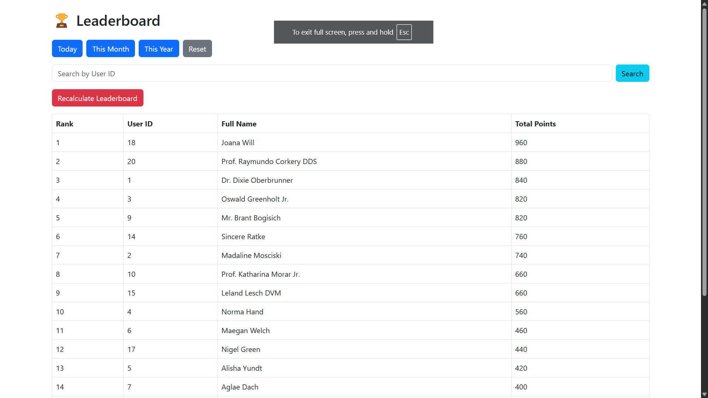

# Laravel Leaderboard


A Laravel-based leaderboard system that tracks user activities, calculates points, and ranks users based on their total points. The leaderboard can be filtered by day, month, or year, and it supports dynamic searching, recalculating leaderboard rankings, and displaying user details. The app is styled with a dark theme.



## Features

- **Leaderboard**: Displays users with their rank, user ID, full name, and total points.
- **Filters**: Filters data by day, month, or year to show leaderboard for different periods.
- **Search**: Allows searching by User ID.
- **Recalculation**: Option to recalculate the leaderboard.
  
## Prerequisites

Before starting, ensure you have the following:

- PHP >= 8.0
- Composer (for PHP dependency management)
- MySQL (or any other supported database)

## Installation

Follow these steps to set up the project on your local machine:

### 1. Clone the repository

Open your terminal and run the following command to clone the repository:

```bash
git clone https://github.com/the-chanchle/intelivita-assignment.git
cd intelivita-assignment
```

### 2. Install PHP dependencies

Run the following command to install the PHP dependencies using Composer:

```bash
composer install
```

### 3. Set up environment variables

Copy the `.env.example` file to `.env`:

```bash
cp .env.example .env
```

Open the `.env` file and configure your database connection:

```env
DB_CONNECTION=mysql
DB_HOST=127.0.0.1
DB_PORT=3306
DB_DATABASE=intelivita_assignment
DB_USERNAME=root
DB_PASSWORD=
```

Adjust these settings to match your local or production database configuration.

### 4. Generate application key

Laravel requires an application key. Generate it using the following command:

```bash
php artisan key:generate
```

### 5. Run migrations and seed the database

To set up the database and seed it with sample data, run:

```bash
php artisan migrate --seed
```

This will create the necessary tables and populate them with sample data.

### 6. Serve the application

You can now run the application locally using:

```bash
php artisan serve
```

This will start a development server at [http://localhost:8000](http://localhost:8000).

## Usage

Once the application is running, you can interact with the leaderboard:

- **Filters**: Use the filter buttons ("Today", "This Month", "This Year") to view the leaderboard for specific time periods.
- **Search**: You can search the leaderboard by entering a User ID in the search bar.
- **Recalculation**: If you want to recalculate the leaderboard, click the "Recalculate Leaderboard" button.

## License

This project is open-source and available under the [MIT License](LICENSE).

---

## 📞 Contact

For any queries, feel free to reach out:

- **Email**: omkarchanchle.dev@gmail.com  
- **Phone**: 8758514393
